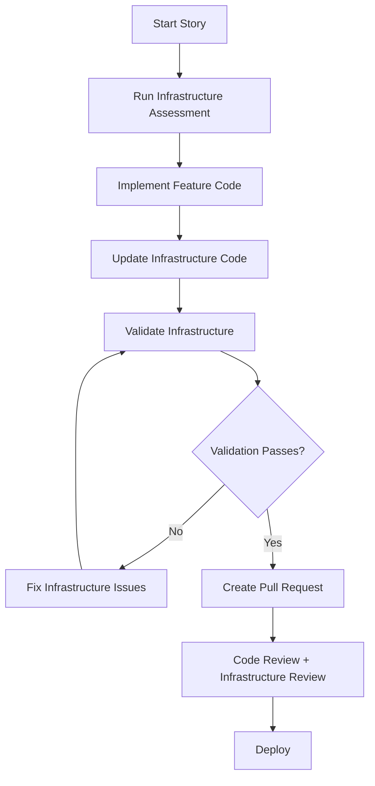

# Infrastructure-Aware Development Process

This document outlines the enhanced development process that prevents developers from forgetting infrastructure updates when implementing user stories.

## Overview

The infrastructure-aware development process integrates infrastructure considerations directly into the story development workflow, ensuring that API endpoints, Lambda functions, database changes, and AWS services are properly configured before code is merged.

## Process Flow



## Tools and Scripts

### 1. Story Infrastructure Checker
**Command:** `npm run story:start`

Interactive tool that helps developers assess infrastructure requirements at the beginning of story development.

**Usage:**
```bash
npm run story:start
# Follow the interactive prompts to identify:
# - Frontend changes needed
# - Backend API endpoints 
# - Database modifications
# - Infrastructure updates required
```

### 2. Infrastructure Validator
**Command:** `npm run infrastructure:validate`

Automated script that validates infrastructure consistency by checking:
- API endpoints in handlers match API Gateway configuration
- Lambda functions are properly defined in CDK
- Environment variables are configured correctly
- CDK synthesis succeeds

**Usage:**
```bash
npm run infrastructure:validate
# Outputs validation results and errors to fix
```

### 3. Infrastructure Planner
**Command:** `npm run infrastructure:plan`

Shows what infrastructure changes will be deployed by running CDK diff.

**Usage:**
```bash
npm run infrastructure:plan
# Shows AWS resources that will be created/modified/deleted
```

### 4. Feature Infrastructure Generator
**Command:** `npm run infrastructure:generate`

Generates CDK boilerplate code from feature infrastructure definitions.

**Usage:**
```bash
npm run infrastructure:generate
# Reads feature infrastructure files and generates CDK templates
```

### 5. Story Completion Checker
**Command:** `npm run story:complete`

Runs comprehensive validation before story completion.

**Usage:**
```bash
npm run story:complete
# Runs: infrastructure:validate + infrastructure:plan
```

### 6. Workflow Helper
**Command:** `node scripts/workflow-helper.js`

Interactive guided workflow for common development tasks.

**Usage:**
```bash
node scripts/workflow-helper.js
# Provides menu-driven interface for:
# 1. Start story workflow
# 2. Complete story workflow  
# 3. Generate infrastructure
# 4. Validate infrastructure
# 5. Plan changes
# 6. Quick setup
```

## Development Workflow

### Phase 1: Story Planning
1. Review story requirements using infrastructure-aware story template
2. Run infrastructure assessment: `npm run story:start`
3. Complete Infrastructure Impact Assessment section
4. Plan implementation approach

### Phase 2: Development
1. Implement feature code (frontend/backend)
2. Update infrastructure definitions in `apps/api/src/features/*/infrastructure.ts`
3. Update CDK configuration files
4. Add/update database migrations
5. Configure environment variables

### Phase 3: Validation
1. Run infrastructure validation: `npm run infrastructure:validate`
2. Fix any validation errors
3. Review planned changes: `npm run infrastructure:plan`
4. Verify changes match story requirements
5. Run story completion check: `npm run story:complete`

### Phase 4: Review & Deploy
1. Create Pull Request using infrastructure-aware PR template
2. Complete infrastructure checklist in PR
3. Request code review and infrastructure review
4. Deploy to staging after approval

## Feature Infrastructure Co-location

Each feature maintains its infrastructure requirements in dedicated files:

```
apps/api/src/features/
├── travel-requests/
│   ├── infrastructure.ts          # Infrastructure definition
│   ├── handlers/                  # Lambda handlers
│   └── types.ts                   # Domain types
├── employee-management/
│   └── infrastructure.ts
└── project-management/
    └── infrastructure.ts
```

### Infrastructure Definition Format

```typescript
export const featureInfrastructure: FeatureInfrastructure = {
  lambdaFunctions: [
    {
      name: 'submit-travel-request',
      handler: 'apps/api/src/handlers/travel-requests/submit.handler',
      description: 'Handles travel request submission',
      timeout: 30,
      memory: 512
    }
  ],
  apiRoutes: [
    {
      method: 'POST',
      path: '/travel-requests',
      lambdaFunction: 'submit-travel-request',
      requiresAuth: true,
      description: 'Submit new travel request'
    }
  ],
  environmentVariables: ['DATABASE_URL', 'SES_ENDPOINT'],
  iamPermissions: ['rds-db:connect', 'ses:SendEmail'],
  databaseMigrations: ['001_create_travel_requests.sql'],
  awsServices: ['API Gateway', 'Lambda', 'RDS', 'SES']
};
```

## Automated Validation

### Pre-commit Hooks
Git pre-commit hooks automatically run infrastructure validation when developers commit changes to API or infrastructure files:

```bash
# .husky/pre-commit runs:
1. ESLint + Prettier (existing)
2. Infrastructure validation (new)
3. Exit with error if validation fails
```

### CI/CD Integration
Infrastructure validation is integrated into the continuous integration pipeline:

```yaml
# In CI pipeline:
- name: Validate Infrastructure
  run: npm run infrastructure:validate

- name: Plan Infrastructure Changes  
  run: npm run infrastructure:plan
```

## Story Templates

### Enhanced Story Template (BMAD Core)
The BMAD story template (`.bmad-core/templates/story-tmpl.yaml`) now includes mandatory Infrastructure Impact Assessment section:

- **Frontend Changes:** Components, routing, state management
- **Backend Changes:** API endpoints, Lambda functions, database
- **Infrastructure Changes:** API Gateway, CDK, environment variables
- **Development Environment:** Docker, LocalStack, sample data

### Pull Request Template  
PRs include comprehensive infrastructure checklist:

- **API & Lambda Functions:** Endpoint and function configuration
- **Environment & Configuration:** Variable configuration
- **Database & Migrations:** Schema changes and migrations
- **Permissions & Security:** IAM and auth configuration
- **AWS Services:** Service integration and naming

## Benefits

### For Developers
- **Clear guidance** on infrastructure requirements
- **Automated validation** catches issues early
- **Consistent patterns** across all features
- **Reduced context switching** between feature and infrastructure work

### For Team
- **No more missing infrastructure** in deployments
- **Faster code reviews** with structured checklists
- **Better documentation** of infrastructure decisions
- **Reduced deployment failures** due to missing configuration

### For Project
- **Higher deployment success rate**
- **Better system maintainability**
- **Consistent infrastructure patterns**
- **Improved developer onboarding**

## Troubleshooting

### Common Issues

**Infrastructure validation fails:**
```bash
# Check specific errors:
npm run infrastructure:validate

# Common fixes:
# 1. Add missing API Gateway routes
# 2. Configure Lambda functions in CDK
# 3. Add environment variables
# 4. Fix CDK synthesis errors
```

**CDK diff shows unexpected changes:**
```bash
# Review current state:
npm run infrastructure:plan

# Compare with feature requirements:
# 1. Check feature infrastructure definitions
# 2. Verify CDK configuration matches
# 3. Update infrastructure files if needed
```

**Pre-commit hook blocks commit:**
```bash
# Fix infrastructure issues first:
npm run infrastructure:validate

# Then commit again:
git commit -m "Your commit message"
```

## Migration Guide

### For Existing Features
1. Create infrastructure definition file for each feature
2. Run infrastructure generator to create CDK templates
3. Update existing CDK files to match generated patterns
4. Validate infrastructure consistency
5. Update documentation

### For New Features  
1. Use enhanced story template
2. Complete infrastructure assessment
3. Follow standard development workflow
4. Use validation tools throughout development
5. Complete infrastructure checklist in PR

---

## Quick Reference Commands

```bash
# Story workflow
npm run story:start              # Interactive infrastructure assessment
npm run story:complete           # Validate infrastructure before completion

# Infrastructure management  
npm run infrastructure:validate  # Check infrastructure consistency
npm run infrastructure:plan      # Show planned AWS changes
npm run infrastructure:generate  # Generate CDK from feature definitions

# Development workflow
node scripts/workflow-helper.js  # Interactive workflow guide
npm run dev:env                  # Start development environment
./test-setup.sh                  # Validate environment health
```