# RegularTravelManager Fullstack Architecture Document

**Session Date:** 2025-08-30
**Facilitator:** Business Analyst Mary
**Participant:** RegularTravelManager Developer

## Introduction

This document outlines the complete fullstack architecture for **RegularTravelManager**, including backend systems, frontend implementation, and their integration. It serves as the single source of truth for AI-driven development, ensuring consistency across the entire technology stack.

This unified approach combines what would traditionally be separate backend and frontend architecture documents, streamlining the development process for modern fullstack applications where these concerns are increasingly intertwined.

### Starter Template Analysis

**Decision:** N/A - Greenfield project

### Change Log

| Date | Version | Description | Author |
|------|---------|-------------|--------|
| 2025-08-30 | 1.1 | Updated to use Angular insterad of react | Architect Winston |
| 2025-08-30 | 1.0 | Initial architecture document | Architect Winston |

## High Level Architecture

### Technical Summary

RegularTravelManager will use **AWS serverless architecture** with an Angular-based frontend hosted on S3/CloudFront and a Node.js serverless backend using Lambda + API Gateway. **Amazon Cognito** handles authentication for employees and managers, while **RDS PostgreSQL** with PostGIS extension manages relational data and geographic calculations. **AWS SES** provides email notifications for the request-approval workflow. The architecture leverages **AWS CDK** for infrastructure-as-code, ensuring enterprise-grade security, scalability, and compliance suitable for Swiss business requirements.

### Platform and Infrastructure Choice

**Platform:** AWS Full Stack
**Key Services:** 
- Frontend: S3 + CloudFront + Route 53
- Backend: Lambda + API Gateway + RDS PostgreSQL
- Auth: Amazon Cognito User Pools
- Notifications: SES (Simple Email Service)  
- Infrastructure: AWS CDK for deployment automation

**Deployment Host and Regions:** 
- Primary: eu-central-1 (Frankfurt) for Swiss data residency
- CloudFront global edge locations for performance

### Repository Structure

**Structure:** Monorepo with Domain-Driven Design organization
**Monorepo Tool:** npm workspaces
**Package Organization:**

**Domain-Centric Structure:**
- `domains/` - Core business domains and bounded contexts
  - `travel-allowance/` - Main travel allowance domain
  - `employee-management/` - Employee data and profiles domain
  - `project-management/` - Project and location data domain
- `apps/` - Application entry points  
- `shared-kernel/` - Cross-domain shared concepts
- `infrastructure/` - External concerns (AWS, databases, etc.)

### High Level Architecture Diagram

```mermaid
graph TB
    User[👤 Employee/Manager] --> CF[☁️ CloudFront CDN]
    CF --> S3[📦 S3 Static Hosting<br/>Angular App]
    
    S3 --> API[🚀 API Gateway<br/>REST API]
    API --> Lambda[⚡ Lambda Functions<br/>Node.js/TypeScript]
    
    Lambda --> RDS[(🗄️ RDS PostgreSQL<br/>PostGIS Extension)]
    Lambda --> Cognito[🔐 Amazon Cognito<br/>User Management]
    Lambda --> SES[📧 Simple Email Service<br/>Notifications]
    
    subgraph "AWS Services"
        CF
        S3
        API
        Lambda
        RDS
        Cognito
        SES
    end
    
    subgraph "Infrastructure as Code"
        CDK[📋 AWS CDK<br/>TypeScript]
    end
    
    CDK -.-> API
    CDK -.-> Lambda
    CDK -.-> RDS
    CDK -.-> Cognito
```



### Architectural Patterns

- **Serverless Architecture:** Lambda functions with API Gateway for backend logic - _Rationale:_ Auto-scaling, pay-per-request, minimal infrastructure management for business applications
- **Component-Based UI:** Reusable Angular components with TypeScript - _Rationale:_ Superior form handling and enterprise features for forms-heavy travel management interface
- **Infrastructure as Code:** AWS CDK for all resource provisioning - _Rationale:_ Version-controlled infrastructure, consistent deployments, easy environment replication
- **Event-Driven Notifications:** Lambda triggers for email notifications on request status changes - _Rationale:_ Decoupled notification system, reliable delivery via SES
- **Geographic Database Functions:** PostGIS extension in RDS for distance calculations - _Rationale:_ Server-side geographic calculations ensure accuracy and consistency

## Tech Stack

This is the **definitive technology selection** for RegularTravelManager. All development must use these exact versions and technologies.

### Technology Stack Table

| Category | Technology | Version | Purpose | Rationale |
|----------|------------|---------|---------|-----------|
| Frontend Language | TypeScript | 5.3+ | Type-safe frontend development | Essential for DDD value objects and domain models shared across layers |
| Frontend Framework | Angular | 17+ | Full-featured frontend framework | Enterprise-grade framework with built-in DI, forms, routing, and TypeScript-first approach ideal for business applications |
| UI Component Library | Angular Material | 17+ | Swiss-business appropriate UI components | Professional Material Design components with excellent form controls and accessibility for employee/manager interfaces |
| State Management | NgRx | 17+ | Enterprise state management | Redux-based pattern with excellent TypeScript support, perfect for DDD command/query separation and complex business workflows |
| Backend Language | TypeScript | 5.3+ | Unified language across stack | Shared domain models between frontend/backend, consistent DDD implementation |
| Backend Framework | AWS Lambda + Fastify | Lambda Runtime v20, Fastify 4.24+ | Serverless HTTP framework | Fast startup times for Lambda, excellent TypeScript support, minimal overhead |
| API Style | REST | OpenAPI 3.0 | HTTP API design | Clear contract definition, excellent tooling, aligns with AWS API Gateway |
| Database | Amazon RDS PostgreSQL | 15+ with PostGIS | Relational database with geographic functions | ACID compliance for business transactions, PostGIS for distance calculations, DDD aggregate persistence |
| Cache | Amazon ElastiCache Redis | 7.0+ | Session and query caching | Fast lookup for employee data and project information |
| File Storage | Amazon S3 | Current | Document storage for attachments | Reliable file storage for request documentation if needed |
| Authentication | Amazon Cognito | Current | User management and authentication | Managed service for employee/manager authentication, integrates with Lambda |
| Frontend Testing | Jest + Angular Testing Utilities | Jest 29+, Angular 17+ | Unit and integration testing | Angular's built-in testing framework with excellent component and service testing |
| Backend Testing | Vitest + Supertest | Vitest 1.0+, Supertest 6+ | API and domain logic testing | Unified test runner across stack, excellent for testing DDD command handlers |
| E2E Testing | Playwright | 1.40+ | End-to-end user workflows | Reliable browser automation for testing request-approval workflows |
| Build Tool | Angular CLI | 17+ | Angular development toolchain | Integrated build system with TypeScript, testing, and deployment tools optimized for Angular |
| Bundler | esbuild | 0.19+ | Fast JavaScript bundling | Used by Vite and AWS Lambda for optimal bundle sizes |
| IaC Tool | AWS CDK | 2.100+ | Infrastructure as code | TypeScript-based infrastructure matching application language |
| CI/CD | GitHub Actions | Current | Automated testing and deployment | Integrates well with AWS CDK, good monorepo support |
| Monitoring | AWS CloudWatch | Current | Application and infrastructure monitoring | Native AWS integration, custom metrics for business KPIs |
| Logging | AWS CloudWatch Logs | Current | Centralized logging | Structured logging with Lambda integration |
| CSS Framework | Tailwind CSS | 3.3+ | Utility-first styling | Rapid UI development, works well with Ant Design for custom styling |

## Data Models

Based on our brainstorming session and DDD approach, here are the core domain models that will be shared between frontend and backend:

### TravelRequest

**Purpose:** Core aggregate root representing an employee's request for regular travel allowance

**Key Attributes:**
- id: string - Unique identifier for the request
- employeeId: string - Reference to the requesting employee
- managerId: string - Reference to the approving manager
- projectId: string - Reference to the project
- subProjectId: string - Reference to the specific subproject
- daysPerWeek: number - Number of travel days requested per week
- justification: string - Employee's reason for the travel request
- status: RequestStatus - Current approval status
- calculatedDistance: number - Straight-line distance in kilometers
- calculatedAllowance: number - Daily allowance amount in CHF
- submittedAt: Date - When the request was submitted
- processedAt: Date | null - When approved/rejected
- processedBy: string | null - Manager who processed the request
- rejectionReason: string | null - Reason if rejected

#### TypeScript Interface
```typescript
interface TravelRequest {
  id: string;
  employeeId: string;
  managerId: string;
  projectId: string;
  subProjectId: string;
  daysPerWeek: number;
  justification: string;
  status: RequestStatus;
  calculatedDistance: number;
  calculatedAllowance: number;
  submittedAt: Date;
  processedAt: Date | null;
  processedBy: string | null;
  rejectionReason: string | null;
}
```

#### Relationships
- Belongs to one Employee (employeeId)
- Managed by one Manager (managerId)
- References one Project and SubProject
- Can have multiple StatusHistory entries

### Employee

**Purpose:** Represents an employee who can submit travel requests

**Key Attributes:**
- id: string - Unique employee identifier
- email: string - Employee email address
- firstName: string - Employee first name
- lastName: string - Employee last name
- homeAddress: Address - Employee's home location for distance calculation
- managerId: string - Default manager for requests
- isActive: boolean - Whether employee can submit requests

#### TypeScript Interface
```typescript
interface Employee {
  id: string;
  email: string;
  firstName: string;
  lastName: string;
  homeAddress: Address;
  managerId: string;
  isActive: boolean;
}
```

#### Relationships
- Has many TravelRequests
- Reports to one Manager
- Has one Address

### Project

**Purpose:** Represents a project with specific locations where employees travel

**Key Attributes:**
- id: string - Unique project identifier
- name: string - Project display name
- description: string - Project description
- isActive: boolean - Whether project accepts new requests
- defaultCostPerKm: number - Default CHF rate per kilometer

#### TypeScript Interface
```typescript
interface Project {
  id: string;
  name: string;
  description: string;
  isActive: boolean;
  defaultCostPerKm: number;
}
```

#### Relationships
- Has many SubProjects
- Referenced by many TravelRequests

### SubProject

**Purpose:** Specific work location within a project with precise geographic coordinates

**Key Attributes:**
- id: string - Unique subproject identifier
- projectId: string - Parent project reference
- name: string - Subproject display name
- location: Location - Geographic coordinates and address
- costPerKm: number - Specific CHF rate per kilometer (can override project default)
- isActive: boolean - Whether subproject accepts new requests

#### TypeScript Interface
```typescript
interface SubProject {
  id: string;
  projectId: string;
  name: string;
  location: Location;
  costPerKm: number;
  isActive: boolean;
}
```

#### Relationships
- Belongs to one Project
- Referenced by many TravelRequests
- Has one Location

### Address (Value Object)

**Purpose:** Immutable address representation for distance calculations

#### TypeScript Interface
```typescript
interface Address {
  street: string;
  city: string;
  postalCode: string;
  country: string;
  latitude: number;
  longitude: number;
}
```

### Location (Value Object)

**Purpose:** Geographic location with coordinates for project sites

#### TypeScript Interface
```typescript
interface Location {
  address: Address;
  coordinates: {
    latitude: number;
    longitude: number;
  };
}
```

### RequestStatus (Enum)

**Purpose:** Defines valid states for travel requests

#### TypeScript Interface
```typescript
enum RequestStatus {
  PENDING = 'pending',
  APPROVED = 'approved',
  REJECTED = 'rejected',
  WITHDRAWN = 'withdrawn'
}
```

## API Specification

Based on the REST API style from our tech stack and the core workflows identified in brainstorming, here's the complete OpenAPI specification for RegularTravelManager:

```yaml
openapi: 3.0.0
info:
  title: RegularTravelManager API
  version: 1.0.0
  description: REST API for managing employee travel allowance requests and approvals
servers:
  - url: https://api.regulartravelmanager.com/v1
    description: Production API
    
components:
  securitySchemes:
    CognitoAuth:
      type: http
      scheme: bearer
      bearerFormat: JWT
      
  schemas:
    TravelRequest:
      type: object
      required: [employeeId, managerId, projectId, subProjectId, daysPerWeek, justification]
      properties:
        id:
          type: string
          format: uuid
        employeeId:
          type: string
          format: uuid
        managerId:
          type: string
          format: uuid
        projectId:
          type: string
          format: uuid
        subProjectId:
          type: string
          format: uuid
        daysPerWeek:
          type: integer
          minimum: 1
          maximum: 7
        justification:
          type: string
          minLength: 10
          maxLength: 500
        status:
          type: string
          enum: [pending, approved, rejected, withdrawn]
        calculatedDistance:
          type: number
          format: float
        calculatedAllowance:
          type: number
          format: float
        submittedAt:
          type: string
          format: date-time
        processedAt:
          type: string
          format: date-time
          nullable: true
        processedBy:
          type: string
          format: uuid
          nullable: true
        rejectionReason:
          type: string
          nullable: true

security:
  - CognitoAuth: []

paths:
  /travel-requests:
    post:
      summary: Submit a new travel request
      tags: [Travel Requests]
      requestBody:
        required: true
        content:
          application/json:
            schema:
              type: object
              required: [managerId, projectId, subProjectId, daysPerWeek, justification]
              properties:
                managerId:
                  type: string
                  format: uuid
                projectId:
                  type: string
                  format: uuid
                subProjectId:
                  type: string
                  format: uuid
                daysPerWeek:
                  type: integer
                  minimum: 1
                  maximum: 7
                justification:
                  type: string
                  minLength: 10
                  maxLength: 500
      responses:
        '201':
          description: Travel request created successfully
          content:
            application/json:
              schema:
                $ref: '#/components/schemas/TravelRequest'
                
  /manager/requests:
    get:
      summary: Get requests for manager approval
      tags: [Manager]
      parameters:
        - name: status
          in: query
          schema:
            type: string
            enum: [pending, approved, rejected]
            default: pending
      responses:
        '200':
          description: List of requests for approval
          content:
            application/json:
              schema:
                type: object
                properties:
                  requests:
                    type: array
                    items:
                      $ref: '#/components/schemas/TravelRequest'
```

## Components

Based on our DDD architecture, AWS serverless platform, and identified workflows, here are the major logical components across the fullstack:

### TravelRequestService

**Responsibility:** Core domain service managing the complete travel request lifecycle including submission, processing, and status management

**Key Interfaces:**
- `submitRequest(dto: CreateTravelRequestDto): Promise<TravelRequest>`
- `processRequest(requestId: string, action: ProcessAction): Promise<TravelRequest>`
- `getRequestsByEmployee(employeeId: string): Promise<TravelRequest[]>`
- `getRequestsForManager(managerId: string): Promise<TravelRequest[]>`

**Dependencies:** TravelRequestRepository, DistanceCalculator, AllowanceCalculator, NotificationService

**Technology Stack:** Lambda functions with Fastify, TypeScript domain models, PostgreSQL with repository pattern

### DistanceCalculator

**Responsibility:** Calculates straight-line distance between employee home address and project subproject location

**Key Interfaces:**
- `calculateDistance(from: Address, to: Address): Promise<number>`
- `validateCoordinates(address: Address): boolean`

**Dependencies:** PostGIS geometric functions, Address value objects

**Technology Stack:** PostgreSQL PostGIS ST_Distance function, TypeScript geometric calculations as fallback

### NotificationService

**Responsibility:** Handles email notifications for request status changes and new submissions

**Key Interfaces:**
- `notifyRequestSubmitted(request: TravelRequest, manager: Employee): Promise<void>`
- `notifyRequestApproved(request: TravelRequest, employee: Employee): Promise<void>`
- `notifyRequestRejected(request: TravelRequest, employee: Employee, reason: string): Promise<void>`

**Dependencies:** AWS SES, Employee data for email addresses, email templates

**Technology Stack:** AWS SES SDK, TypeScript template engine, Lambda event triggers

## Core Workflows

### Primary Workflow: Request Submission → Manager Approval


## Database Schema

PostgreSQL schema with PostGIS for geographic calculations:

```sql
-- Enable PostGIS extension for geographic functions
CREATE EXTENSION IF NOT EXISTS postgis;
CREATE EXTENSION IF NOT EXISTS "uuid-ossp";

-- Employees table with home address and coordinates
CREATE TABLE employees (
    id UUID PRIMARY KEY DEFAULT uuid_generate_v4(),
    email VARCHAR(255) NOT NULL UNIQUE,
    first_name VARCHAR(100) NOT NULL,
    last_name VARCHAR(100) NOT NULL,
    home_street VARCHAR(255) NOT NULL,
    home_city VARCHAR(100) NOT NULL,
    home_postal_code VARCHAR(20) NOT NULL,
    home_country VARCHAR(100) NOT NULL DEFAULT 'Switzerland',
    home_location GEOMETRY(POINT, 4326) NOT NULL,
    manager_id UUID REFERENCES employees(id),
    is_active BOOLEAN NOT NULL DEFAULT true,
    created_at TIMESTAMP WITH TIME ZONE DEFAULT CURRENT_TIMESTAMP,
    updated_at TIMESTAMP WITH TIME ZONE DEFAULT CURRENT_TIMESTAMP
);

-- Projects table for organizing work locations
CREATE TABLE projects (
    id UUID PRIMARY KEY DEFAULT uuid_generate_v4(),
    name VARCHAR(255) NOT NULL,
    description TEXT,
    default_cost_per_km DECIMAL(10,2) NOT NULL CHECK (default_cost_per_km > 0),
    is_active BOOLEAN NOT NULL DEFAULT true,
    created_at TIMESTAMP WITH TIME ZONE DEFAULT CURRENT_TIMESTAMP,
    updated_at TIMESTAMP WITH TIME ZONE DEFAULT CURRENT_TIMESTAMP
);

-- Subprojects table for specific work locations  
CREATE TABLE subprojects (
    id UUID PRIMARY KEY DEFAULT uuid_generate_v4(),
    project_id UUID NOT NULL REFERENCES projects(id),
    name VARCHAR(255) NOT NULL,
    street_address VARCHAR(255) NOT NULL,
    city VARCHAR(100) NOT NULL,
    postal_code VARCHAR(20) NOT NULL,
    country VARCHAR(100) NOT NULL DEFAULT 'Switzerland',
    location GEOMETRY(POINT, 4326) NOT NULL,
    cost_per_km DECIMAL(10,2) NOT NULL CHECK (cost_per_km > 0),
    is_active BOOLEAN NOT NULL DEFAULT true,
    created_at TIMESTAMP WITH TIME ZONE DEFAULT CURRENT_TIMESTAMP,
    updated_at TIMESTAMP WITH TIME ZONE DEFAULT CURRENT_TIMESTAMP
);

-- Travel requests table (main aggregate)
CREATE TABLE travel_requests (
    id UUID PRIMARY KEY DEFAULT uuid_generate_v4(),
    employee_id UUID NOT NULL REFERENCES employees(id),
    manager_id UUID NOT NULL REFERENCES employees(id),
    project_id UUID NOT NULL REFERENCES projects(id),
    subproject_id UUID NOT NULL REFERENCES subprojects(id),
    days_per_week INTEGER NOT NULL CHECK (days_per_week >= 1 AND days_per_week <= 7),
    justification TEXT NOT NULL CHECK (LENGTH(justification) >= 10),
    status VARCHAR(20) NOT NULL CHECK (status IN ('pending', 'approved', 'rejected', 'withdrawn')),
    calculated_distance_km DECIMAL(10,3) NOT NULL CHECK (calculated_distance_km >= 0),
    calculated_allowance_chf DECIMAL(10,2) NOT NULL CHECK (calculated_allowance_chf >= 0),
    submitted_at TIMESTAMP WITH TIME ZONE NOT NULL DEFAULT CURRENT_TIMESTAMP,
    processed_at TIMESTAMP WITH TIME ZONE NULL,
    processed_by UUID NULL REFERENCES employees(id),
    rejection_reason TEXT NULL,
    created_at TIMESTAMP WITH TIME ZONE DEFAULT CURRENT_TIMESTAMP,
    updated_at TIMESTAMP WITH TIME ZONE DEFAULT CURRENT_TIMESTAMP
);

-- Employee address history for audit trail
CREATE TABLE employee_address_history (
    id UUID PRIMARY KEY DEFAULT uuid_generate_v4(),
    employee_id UUID NOT NULL REFERENCES employees(id),
    previous_street VARCHAR(255) NOT NULL,
    previous_city VARCHAR(100) NOT NULL,
    previous_postal_code VARCHAR(20) NOT NULL,
    previous_country VARCHAR(100) NOT NULL,
    previous_location GEOMETRY(POINT, 4326) NOT NULL,
    new_street VARCHAR(255) NOT NULL,
    new_city VARCHAR(100) NOT NULL,
    new_postal_code VARCHAR(20) NOT NULL,
    new_country VARCHAR(100) NOT NULL,
    new_location GEOMETRY(POINT, 4326) NOT NULL,
    change_reason TEXT,
    changed_at TIMESTAMP WITH TIME ZONE NOT NULL DEFAULT CURRENT_TIMESTAMP,
    changed_by UUID NOT NULL REFERENCES employees(id)
);

-- Request status history for audit trail  
CREATE TABLE request_status_history (
    id UUID PRIMARY KEY DEFAULT uuid_generate_v4(),
    travel_request_id UUID NOT NULL REFERENCES travel_requests(id),
    previous_status VARCHAR(20),
    new_status VARCHAR(20) NOT NULL,
    comment TEXT,
    changed_at TIMESTAMP WITH TIME ZONE NOT NULL DEFAULT CURRENT_TIMESTAMP,
    changed_by UUID NOT NULL REFERENCES employees(id)
);

-- Database indexes for performance
CREATE INDEX idx_employees_manager_id ON employees(manager_id);
CREATE INDEX idx_employees_location ON employees USING GIST (home_location);
CREATE INDEX idx_projects_is_active ON projects(is_active);
CREATE INDEX idx_subprojects_project_id ON subprojects(project_id);
CREATE INDEX idx_subprojects_location ON subprojects USING GIST (location);
CREATE INDEX idx_subprojects_is_active ON subprojects(is_active);
CREATE INDEX idx_travel_requests_employee_id ON travel_requests(employee_id);
CREATE INDEX idx_travel_requests_manager_id ON travel_requests(manager_id);
CREATE INDEX idx_travel_requests_status ON travel_requests(status);
CREATE INDEX idx_travel_requests_submitted_at ON travel_requests(submitted_at);
CREATE INDEX idx_employee_address_history_employee_id ON employee_address_history(employee_id);
CREATE INDEX idx_request_status_history_travel_request_id ON request_status_history(travel_request_id);

-- Function to calculate distance using PostGIS
CREATE OR REPLACE FUNCTION calculate_travel_distance(
    employee_location GEOMETRY,
    project_location GEOMETRY
) RETURNS DECIMAL(10,3) AS $$
BEGIN
    RETURN ST_Distance(
        employee_location::geography, 
        project_location::geography
    ) / 1000.0;
END;
$$ LANGUAGE plpgsql IMMUTABLE;
```

## Frontend Architecture

### Component Architecture

Angular components organized by feature modules following DDD principles:

```
apps/web/src/
├── app/
│   ├── features/
│   │   ├── employee/
│   │   │   ├── components/
│   │   │   │   ├── dashboard/
│   │   │   │   ├── new-request/
│   │   │   │   └── travel-request-form/
│   │   │   ├── employee.module.ts
│   │   │   └── employee-routing.module.ts
│   │   ├── manager/
│   │   │   ├── components/
│   │   │   │   ├── dashboard/
│   │   │   │   ├── approvals/
│   │   │   │   └── pending-approvals-table/
│   │   │   ├── manager.module.ts
│   │   │   └── manager-routing.module.ts
│   ├── shared/
│   │   ├── components/
│   │   │   ├── forms/
│   │   │   └── tables/
│   │   └── services/
│   │       ├── travel-request.service.ts
│   │       └── project.service.ts
│   ├── core/
│   │   ├── services/
│   │   │   ├── auth.service.ts
│   │   │   └── notification.service.ts
│   │   └── guards/
│   └── store/
│       ├── travel-request/
│       └── auth/
```

### State Management

NgRx stores following domain separation and feature-based organization:

```typescript
// Travel Request State
export interface TravelRequestState {
  requests: TravelRequest[];
  selectedRequest: TravelRequest | null;
  loading: boolean;
  error: string | null;
}

// Travel Request Actions
export const TravelRequestActions = createActionGroup({
  source: 'Travel Request',
  events: {
    'Submit Request': props<{ dto: CreateTravelRequestDto }>(),
    'Submit Request Success': props<{ request: TravelRequest }>(),
    'Submit Request Failure': props<{ error: string }>(),
    'Approve Request': props<{ requestId: string }>(),
    'Load Requests': emptyProps(),
  },
});

// Travel Request Effects
@Injectable()
export class TravelRequestEffects {
  submitRequest$ = createEffect(() =>
    this.actions$.pipe(
      ofType(TravelRequestActions.submitRequest),
      switchMap(({ dto }) =>
        this.travelRequestService.submitRequest(dto).pipe(
          map(request => TravelRequestActions.submitRequestSuccess({ request })),
          catchError(error => of(TravelRequestActions.submitRequestFailure({ error })))
        )
      )
    )
  );
}
```

## Backend Architecture

### Service Architecture

AWS Lambda functions organized by domain:

```
apps/api/src/
├── handlers/
│   ├── travel-requests/
│   │   ├── submit-request.ts
│   │   ├── get-requests.ts
│   │   └── withdraw-request.ts
│   ├── manager/
│   │   ├── get-pending.ts
│   │   ├── process-request.ts
│   │   └── batch-approve.ts
├── domain/
│   └── travel-allowance/
└── utils/
    ├── lambda-wrapper.ts
    └── db-connection.ts
```

### Authentication

AWS Cognito integration with JWT validation:

```typescript
// Angular Auth Guard
@Injectable()
export class AuthGuard implements CanActivate {
  constructor(
    private authService: AuthService,
    private router: Router
  ) {}

  canActivate(): Observable<boolean> {
    return this.authService.isAuthenticated$.pipe(
      tap(isAuth => {
        if (!isAuth) {
          this.router.navigate(['/login']);
        }
      })
    );
  }
}

// Angular Auth Service
@Injectable({ providedIn: 'root' })
export class AuthService {
  private currentUserSubject = new BehaviorSubject<User | null>(null);
  public currentUser$ = this.currentUserSubject.asObservable();
  public isAuthenticated$ = this.currentUser$.pipe(map(user => !!user));

  constructor(private http: HttpClient) {
    const token = localStorage.getItem('token');
    if (token) {
      this.validateToken(token);
    }
  }

  login(credentials: LoginCredentials): Observable<AuthResponse> {
    return this.http.post<AuthResponse>('/api/auth/login', credentials).pipe(
      tap(response => {
        localStorage.setItem('token', response.token);
        this.currentUserSubject.next(response.user);
      })
    );
  }
}
```

## Unified Project Structure

DDD-based monorepo structure:

```
RegularTravelManager/
├── domains/                           # Domain Layer (Business Logic)
│   ├── travel-allowance/             # Core Domain
│   │   ├── src/
│   │   │   ├── domain/               # Pure business logic
│   │   │   │   ├── entities/
│   │   │   │   │   ├── TravelRequest.ts
│   │   │   │   │   └── Allowance.ts
│   │   │   │   ├── services/
│   │   │   │   │   ├── DistanceCalculator.ts
│   │   │   │   │   └── AllowanceCalculator.ts
│   │   │   │   └── repositories/
│   │   │   │       └── ITravelRequestRepository.ts
│   │   │   ├── application/          # Use cases
│   │   │   │   ├── commands/
│   │   │   │   └── queries/
│   │   │   └── infrastructure/       # Infrastructure adapters
├── apps/                             # Application Layer
│   ├── web/                         # Angular Frontend
│   └── api/                         # Lambda Functions
├── packages/                        # Shared packages
│   ├── shared/                      # Shared types
│   └── ui/                          # UI components
├── infrastructure/                   # AWS CDK
└── docs/
    ├── prd.md
    └── architecture.md
```

## Development Workflow

### Local Development Setup

```bash
# Prerequisites
node --version  # v20+
npm --version   # v9+

# Initial setup
npm install
npm run setup

# Development commands
npm run dev        # Start all services
ng serve          # Angular frontend
npm run dev:web    # Alternative frontend start
npm run dev:api    # Backend only
npm run test       # Run all tests
```

### Environment Configuration

```bash
# Frontend (environment.ts)
export const environment = {
  production: false,
  apiUrl: 'http://localhost:3001/v1',
  cognitoUserPoolId: 'eu-central-1_xxxxx',
  cognitoClientId: 'xxxxx'
};

# Backend (.env)
DB_HOST=localhost
DB_PORT=5432
DB_NAME=travel_manager
COGNITO_USER_POOL_ID=eu-central-1_xxxxx
AWS_REGION=eu-central-1
```

## Deployment Architecture

### Deployment Strategy

**Frontend Deployment:**
- Platform: AWS S3 + CloudFront
- Build Command: `ng build --configuration production`
- Output Directory: `apps/web/dist/web`

**Backend Deployment:**
- Platform: AWS Lambda + API Gateway
- Build Command: `npm run build:api`
- Deployment Method: AWS CDK

### Environments

| Environment | Frontend URL | Backend URL | Purpose |
|-------------|-------------|-------------|---------|
| Development | localhost:3000 | localhost:3001 | Local development |
| Staging | staging.travel.com | api-staging.travel.com | Pre-production testing |
| Production | travel.com | api.travel.com | Live environment |

## Security and Performance

### Security Requirements

**Frontend Security:**
- CSP Headers: strict-dynamic with nonce
- XSS Prevention: Content sanitization, secure headers
- Secure Storage: JWT tokens in httpOnly cookies

**Backend Security:**
- Input Validation: OpenAPI schema validation
- Rate Limiting: API Gateway throttling
- CORS Policy: Restricted origins only

**Authentication Security:**
- Token Storage: Secure httpOnly cookies
- Session Management: Cognito refresh tokens
- Password Policy: AWS Cognito managed

### Performance Optimization

**Frontend Performance:**
- Bundle Size Target: <200KB initial load
- Loading Strategy: Code splitting, lazy loading
- Caching Strategy: Service worker for static assets

**Backend Performance:**
- Response Time Target: <500ms for API calls
- Database Optimization: Connection pooling, indexed queries
- Caching Strategy: ElastiCache for frequent lookups

## Testing Strategy

### Testing Pyramid

```
        E2E Tests (Playwright)
       /                    \
    Integration Tests (API + DB)
   /                            \
Frontend Unit (Jest + Angular)  Backend Unit (Vitest)
```

### Test Organization

**Frontend Tests:**
- Component tests with Angular Testing Utilities
- Service tests with Angular TestBed
- Integration tests for complete user workflows
- E2E tests for critical business processes

**Backend Tests:**
- Unit tests for domain logic and services
- Integration tests for API endpoints
- Database tests for repository implementations

## Coding Standards

### Critical Fullstack Rules

- **Type Sharing:** Always define types in packages/shared and import from there
- **API Calls:** Never make direct HTTP calls - use the service layer
- **Environment Variables:** Access only through config objects, never process.env directly
- **Error Handling:** All API routes must use the standard error handler
- **State Updates:** Never mutate state directly - use proper state management patterns

### Naming Conventions

| Element | Frontend | Backend | Example |
|---------|----------|---------|---------|
| Components | PascalCase | - | `UserProfileComponent` |
| Services | PascalCase + 'Service' | - | `AuthService` |
| Directives | camelCase | - | `appHighlight` |
| API Routes | - | kebab-case | `/api/user-profile` |
| Database Tables | - | snake_case | `user_profiles` |

## Error Handling Strategy

### Error Response Format

```typescript
interface ApiError {
  error: {
    code: string;
    message: string;
    details?: Record<string, any>;
    timestamp: string;
    requestId: string;
  };
}
```

### Frontend Error Handling

```typescript
// Angular Error Interceptor
@Injectable()
export class ErrorInterceptor implements HttpInterceptor {
  constructor(
    private authService: AuthService,
    private router: Router,
    private snackBar: MatSnackBar
  ) {}

  intercept(req: HttpRequest<any>, next: HttpHandler): Observable<HttpEvent<any>> {
    return next.handle(req).pipe(
      catchError((error: HttpErrorResponse) => {
        if (error.status === 401) {
          this.authService.logout();
          this.router.navigate(['/login']);
        } else if (error.status >= 500) {
          this.snackBar.open('Server error. Please try again later.', 'Close');
        }
        return throwError(error);
      })
    );
  }
}
```

## Monitoring and Observability

### Monitoring Stack

- **Frontend Monitoring:** Sentry for error tracking, Web Vitals
- **Backend Monitoring:** AWS CloudWatch for Lambda metrics
- **Error Tracking:** CloudWatch Logs with structured logging
- **Performance Monitoring:** X-Ray for request tracing

### Key Metrics

**Frontend Metrics:**
- Core Web Vitals (LCP, FID, CLS)
- JavaScript errors and stack traces
- API response times from client perspective
- User interaction analytics

**Backend Metrics:**
- Lambda invocation rate and duration
- API Gateway 4xx/5xx error rates
- Database query performance
- Business KPIs (requests submitted, approval rates)

---

*Architecture document generated using the BMAD-METHOD™ framework*