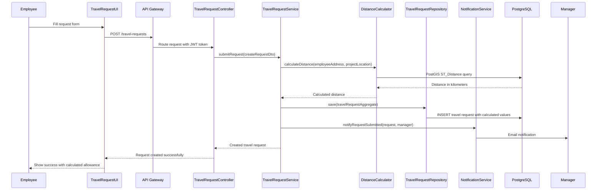

# Core Workflows

## Primary Workflow: Request Submission → Manager Approval

```mermaid
sequenceDiagram
    participant E as Employee
    participant UI as TravelRequestUI
    participant API as API Gateway
    participant TC as TravelRequestController
    participant TS as TravelRequestService
    participant DC as DistanceCalculator
    participant TR as TravelRequestRepository
    participant NS as NotificationService
    participant DB as PostgreSQL
    participant M as Manager

    E->>UI: Fill request form
    UI->>API: POST /travel-requests
    API->>TC: Route request with JWT token
    TC->>TS: submitRequest(createRequestDto)
    
    TS->>DC: calculateDistance(employeeAddress, projectLocation)
    DC->>DB: PostGIS ST_Distance query
    DB-->>DC: Distance in kilometers
    DC-->>TS: Calculated distance
    
    TS->>TR: save(travelRequestAggregate)
    TR->>DB: INSERT travel request with calculated values
    
    TS->>NS: notifyRequestSubmitted(request, manager)
    NS->>M: Email notification
    
    TS-->>TC: Created travel request
    TC-->>UI: Request created successfully
    UI-->>E: Show success with calculated allowance
```
