# High Level Architecture

## Technical Summary

RegularTravelManager will use **AWS serverless architecture** with an Angular-based frontend hosted on S3/CloudFront and a Node.js serverless backend using Lambda + API Gateway. **Amazon Cognito** handles authentication for employees and managers, while **RDS PostgreSQL** with PostGIS extension manages relational data and geographic calculations. **AWS SES** provides email notifications for the request-approval workflow. The architecture leverages **AWS CDK** for infrastructure-as-code, ensuring enterprise-grade security, scalability, and compliance suitable for Swiss business requirements.

## Platform and Infrastructure Choice

**Platform:** AWS Full Stack
**Key Services:** 
- Frontend: S3 + CloudFront + Route 53
- Backend: Lambda + API Gateway + RDS PostgreSQL
- Auth: Amazon Cognito User Pools
- Notifications: SES (Simple Email Service)  
- Infrastructure: AWS CDK for deployment automation

**Deployment Host and Regions:** 
- Primary: eu-central-1 (Frankfurt) for Swiss data residency
- CloudFront global edge locations for performance

## Repository Structure

**Structure:** Monorepo with Domain-Driven Design organization
**Monorepo Tool:** npm workspaces
**Package Organization:**

**Domain-Centric Structure:**
- `domains/` - Core business domains and bounded contexts
  - `travel-allowance/` - Main travel allowance domain
  - `employee-management/` - Employee data and profiles domain
  - `project-management/` - Project and location data domain
- `apps/` - Application entry points  
- `shared-kernel/` - Cross-domain shared concepts
- `infrastructure/` - External concerns (AWS, databases, etc.)

## High Level Architecture Diagram

```mermaid
graph TB
    User[👤 Employee/Manager] --> CF[☁️ CloudFront CDN]
    CF --> S3[📦 S3 Static Hosting<br/>Angular App]
    
    S3 --> API[🚀 API Gateway<br/>REST API]
    API --> Lambda[⚡ Lambda Functions<br/>Node.js/TypeScript]
    
    Lambda --> RDS[(🗄️ RDS PostgreSQL<br/>PostGIS Extension)]
    Lambda --> Cognito[🔐 Amazon Cognito<br/>User Management]
    Lambda --> SES[📧 Simple Email Service<br/>Notifications]
    
    subgraph "AWS Services"
        CF
        S3
        API
        Lambda
        RDS
        Cognito
        SES
    end
    
    subgraph "Infrastructure as Code"
        CDK[📋 AWS CDK<br/>TypeScript]
    end
    
    CDK -.-> API
    CDK -.-> Lambda
    CDK -.-> RDS
    CDK -.-> Cognito
```

## Architectural Patterns

- **Serverless Architecture:** Lambda functions with API Gateway for backend logic - _Rationale:_ Auto-scaling, pay-per-request, minimal infrastructure management for business applications
- **Component-Based UI:** Reusable Angular components with TypeScript - _Rationale:_ Superior form handling and enterprise features for forms-heavy travel management interface
- **Infrastructure as Code:** AWS CDK for all resource provisioning - _Rationale:_ Version-controlled infrastructure, consistent deployments, easy environment replication
- **Event-Driven Notifications:** Lambda triggers for email notifications on request status changes - _Rationale:_ Decoupled notification system, reliable delivery via SES
- **Geographic Database Functions:** PostGIS extension in RDS for distance calculations - _Rationale:_ Server-side geographic calculations ensure accuracy and consistency
