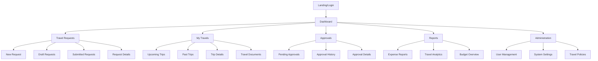
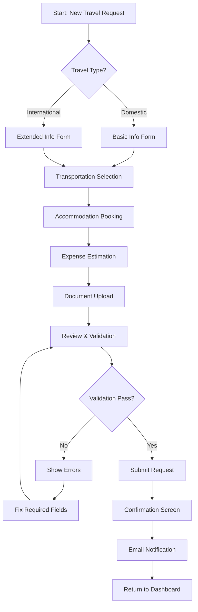
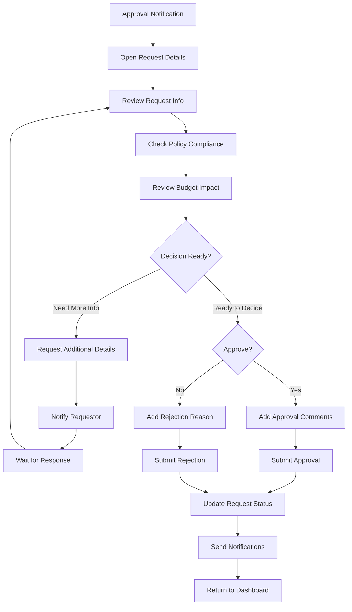

# RegularTravelManager UI/UX Specification

This document defines the user experience goals, information architecture, user flows, and visual design specifications for RegularTravelManager's user interface. It serves as the foundation for visual design and frontend development, ensuring a cohesive and user-centered experience.

## Introduction

This document defines the user experience goals, information architecture, user flows, and visual design specifications for RegularTravelManager's user interface. It serves as the foundation for visual design and frontend development, ensuring a cohesive and user-centered experience.

**Key Decision:** Incorporating Oblique design system principles to ensure compliance with Swiss government digital standards, providing:
- Standardized corporate design look and feel
- Ready-to-use Angular components
- Accessibility compliance with Swiss government requirements
- Consistent user experience across Swiss administration platforms

## Information Architecture (IA)

### Site Map / Screen Inventory

### Navigation Structure

**Primary Navigation:** Following Oblique's master layout pattern with main sections in the sidebar: Dashboard, Travel Requests, My Travels, Approvals, Reports, Administration

**Secondary Navigation:** Contextual sub-navigation within each section using Oblique's tab components and breadcrumb system

**Breadcrumb Strategy:** Oblique's built-in breadcrumb component showing: Section > Subsection > Current Page (e.g., "Travel Requests > New Request > Flight Details")

## User Flows

### Travel Request Submission Flow

**User Goal:** Submit a complete travel request for approval

**Entry Points:** Dashboard "New Request" button, Travel Requests section, Quick actions menu

**Success Criteria:** Request successfully submitted with confirmation and tracking number

#### Flow Diagram

#### Edge Cases & Error Handling:
- Network interruption during submission → Auto-save draft, resume capability
- Invalid travel dates (weekend/holiday restrictions) → Inline validation with policy explanation
- Missing required documents → Progressive disclosure of requirements
- Budget exceeded → Warning with approval workflow escalation
- Duplicate request detection → Offer to edit existing request

**Notes:** Uses Oblique's form validation components and stepper pattern for multi-step process. Leverages Swiss government date/time components for consistent formatting.

### Approval Workflow Flow

**User Goal:** Review and approve/reject travel requests efficiently

**Entry Points:** Dashboard notifications, Approvals section, Email notifications

**Success Criteria:** Decision made with appropriate documentation and notifications sent

#### Flow Diagram

#### Edge Cases & Error Handling:
- Requestor modifies request during approval → Re-approval workflow trigger
- Multiple approvers required → Sequential/parallel approval routing
- Approver unavailable (vacation) → Delegation/escalation options
- Policy changes during approval → Updated compliance check
- System timeout during review → Auto-save comments, session recovery

**Notes:** Integrates with Oblique's notification system and uses government-standard approval workflows. Comments component follows Swiss accessibility guidelines.

## Wireframes & Mockups

**Primary Design Files:** Recommend using Figma with the official Oblique Design System Library (v13.3.2) available in Figma Community - this ensures component accuracy and maintains Swiss government design standards.

### Key Screen Layouts

#### Dashboard Screen
**Purpose:** Provide quick overview and access to key travel management functions

**Key Elements:**
- Oblique master layout with standard Swiss government header and navigation
- Quick action cards using Oblique's card component for "New Request", "Pending Approvals", "Upcoming Trips"
- Status overview widgets showing travel metrics and budget information
- Recent activity feed using Oblique's timeline component
- Emergency travel contact information panel

**Interaction Notes:** Uses Oblique's responsive grid system, cards collapse on mobile, quick actions become floating action button

**Design File Reference:** Create frames for Desktop (1440px), Tablet (768px), and Mobile (375px) breakpoints

#### Travel Request Form
**Purpose:** Streamlined multi-step form for submitting travel requests

**Key Elements:**
- Oblique stepper component showing progress through form sections
- Form sections using Oblique's form field components with Swiss date/time formatting
- File upload area using Oblique's drag-drop component for travel documents
- Budget calculator with real-time expense estimation
- Policy compliance checker with inline validation messages

**Interaction Notes:** Progressive disclosure of fields based on travel type, auto-save functionality, validation uses Oblique's error messaging patterns

**Design File Reference:** Separate frames for each step of the stepper process

#### Approval Dashboard
**Purpose:** Efficient review and decision-making interface for approvers

**Key Elements:**
- Priority inbox using Oblique's table component with sorting and filtering
- Request preview panel with collapsible sections for detailed review
- Decision action bar with approve/reject buttons using Swiss government color scheme
- Comments section using Oblique's textarea and timestamp components
- Delegation interface for approver handoff

**Interaction Notes:** Keyboard shortcuts for power users, bulk actions for multiple requests, real-time updates for request changes

**Design File Reference:** Focus on desktop-first design given approver workflow requirements

## Component Library / Design System

**Design System Approach:** Adopt Oblique as the primary design system foundation, extending it with travel-specific components while maintaining Swiss government design standards. This ensures consistency across Swiss administration platforms and reduces development time through proven, accessible components.

### Core Components

#### Travel Request Card
**Purpose:** Display travel request summary information in dashboard and list views

**Variants:** 
- Compact (dashboard widget)
- Expanded (full details view)
- Mobile (simplified layout)

**States:** Draft, Submitted, Under Review, Approved, Rejected, Cancelled

**Usage Guidelines:** Extends Oblique's base Card component with travel-specific metadata fields. Uses Swiss government status color coding. Always includes accessibility labels for screen readers.

#### Budget Calculator
**Purpose:** Real-time expense calculation and policy compliance checking

**Variants:**
- Inline (within forms)
- Standalone (budget planning mode)
- Summary (approval workflow)

**States:** Calculating, Valid, Over Budget, Policy Violation, Error

**Usage Guidelines:** Built on Oblique's input and validation components. Uses Swiss franc formatting. Integrates with government travel policy APIs for real-time validation.

#### Approval Action Bar
**Purpose:** Streamlined decision-making interface for approvers

**Variants:**
- Standard (approve/reject)
- Conditional (with required fields)
- Bulk (multiple selections)

**States:** Ready, Processing, Completed, Error

**Usage Guidelines:** Uses Oblique's button components with government-standard approve (green) and reject (red) colors. Includes confirmation dialogs for destructive actions. Keyboard accessible for power users.

#### Travel Timeline
**Purpose:** Visual representation of travel itinerary and milestones

**Variants:**
- Compact (overview)
- Detailed (full itinerary)
- Interactive (editable mode)

**States:** Planning, Confirmed, In Progress, Completed, Cancelled

**Usage Guidelines:** Extends Oblique's timeline component with travel-specific icons and formatting. Uses Swiss date/time conventions. Supports accessibility with proper ARIA labels and keyboard navigation.

#### Document Upload Zone
**Purpose:** Secure document management for travel-related files

**Variants:**
- Single file
- Multiple files
- Drag & drop area

**States:** Empty, Uploading, Success, Error, Validation Failed

**Usage Guidelines:** Built on Oblique's file upload component with enhanced security for government documents. Supports common travel document types (PDF, images). Includes virus scanning feedback and encryption status indicators.

## Branding & Style Guide

### Visual Identity
**Brand Guidelines:** Swiss Confederation Web Guidelines (https://swiss.github.io/styleguide/en/) as implemented through Oblique Design System. All visual elements must comply with federal corporate design standards for admin.ch domain applications.

### Color Palette

| Color Type | Hex Code | Usage |
|------------|----------|--------|
| Primary | #DC143C | Swiss red for primary actions, headers, and key UI elements |
| Secondary | #F5F5F5 | Light gray for backgrounds and subtle UI elements |
| Accent | #0F6ECD | Swiss blue for links, information, and secondary actions |
| Success | #00A651 | Approvals, successful submissions, positive status |
| Warning | #FF9500 | Policy warnings, budget alerts, important notices |
| Error | #E60E3A | Errors, rejections, destructive actions |
| Neutral | #666666, #333333, #CCCCCC | Text hierarchy, borders, disabled states |

### Typography

#### Font Families
- **Primary:** "Source Sans Pro", Arial, sans-serif (Oblique default)
- **Secondary:** "Courier New", monospace (for reference numbers, codes)
- **Monospace:** "Source Code Pro", Consolas, monospace (for technical data)

#### Type Scale

| Element | Size | Weight | Line Height |
|---------|------|---------|------------|
| H1 | 2.5rem (40px) | 300 (Light) | 1.2 |
| H2 | 2rem (32px) | 400 (Regular) | 1.3 |
| H3 | 1.5rem (24px) | 600 (Semi-bold) | 1.4 |
| Body | 1rem (16px) | 400 (Regular) | 1.5 |
| Small | 0.875rem (14px) | 400 (Regular) | 1.4 |

### Iconography
**Icon Library:** Oblique's built-in icon set based on Material Design principles, supplemented with Swiss government-specific icons for travel functions (passport, plane, hotel, etc.)

**Usage Guidelines:** Icons must be minimum 24px for touch targets, use consistent stroke width, and include descriptive alt text. Travel-specific icons follow Swiss pictogram standards where available.

### Spacing & Layout
**Grid System:** Oblique's 12-column responsive grid system with 8px base spacing unit

**Spacing Scale:** 4px, 8px, 16px, 24px, 32px, 48px, 64px (following 8px baseline grid)

## Accessibility Requirements

### Compliance Target
**Standard:** WCAG 2.1 AA compliance as required for Swiss Federal Administration digital services, with additional considerations for P028 (Swiss accessibility law) requirements.

### Key Requirements

**Visual:**
- Color contrast ratios: Minimum 4.5:1 for normal text, 3:1 for large text (18pt+), enhanced contrast available via user preference
- Focus indicators: Visible 2px outline with 3:1 contrast ratio, following Oblique's focus management system
- Text sizing: Scalable up to 200% without horizontal scrolling, responsive typography using Oblique's fluid scale

**Interaction:**
- Keyboard navigation: Full functionality available via keyboard, logical tab order, skip links for main content areas
- Screen reader support: Semantic HTML structure, ARIA labels for complex components, live regions for dynamic content updates
- Touch targets: Minimum 44px × 44px for interactive elements, adequate spacing between touch targets (8px minimum)

**Content:**
- Alternative text: Descriptive alt text for informational images, empty alt for decorative images, complex travel charts include long descriptions
- Heading structure: Logical heading hierarchy (H1→H2→H3), no skipping levels, clear section structure
- Form labels: Explicit labels for all form controls, error messages clearly associated with relevant fields, helpful instructions provided

### Testing Strategy
**Automated Testing:** Integration with Oblique's built-in accessibility testing tools, continuous monitoring via axe-core accessibility engine, automated contrast ratio validation

**Manual Testing:** Monthly testing with screen readers (NVDA, JAWS, VoiceOver), keyboard-only navigation testing, testing with users who have disabilities

**User Testing:** Quarterly accessibility user testing sessions with Swiss government employees who use assistive technologies, feedback integration into design updates

## Responsiveness Strategy

### Breakpoints

| Breakpoint | Min Width | Max Width | Target Devices |
|------------|-----------|-----------|----------------|
| Mobile | 320px | 767px | Smartphones, mobile browsers |
| Tablet | 768px | 1023px | Tablets, small laptops |
| Desktop | 1024px | 1439px | Standard desktop, laptop screens |
| Wide | 1440px | - | Large monitors, widescreen displays |

### Adaptation Patterns

**Layout Changes:** 
- Mobile: Single-column layout with collapsible navigation drawer, cards stack vertically, reduced padding/margins
- Tablet: Two-column layout where appropriate, sidebar navigation becomes collapsible, maintain card-based approach
- Desktop: Full multi-column layouts, persistent sidebar navigation, optimal use of horizontal space
- Wide: Enhanced spacing, larger typography scale, additional contextual information panels

**Navigation Changes:**
- Mobile: Hamburger menu with Oblique's mobile navigation drawer, bottom navigation for key actions, collapsible breadcrumbs
- Tablet: Hybrid approach with collapsible sidebar, tab-based secondary navigation, full breadcrumb trail
- Desktop: Full sidebar navigation, horizontal secondary navigation, complete breadcrumb hierarchy
- Wide: Enhanced navigation with preview panels, expanded menu descriptions

**Content Priority:**
- Mobile: Essential information only, progressive disclosure for details, simplified forms with step-by-step flow
- Tablet: Balanced content display, some secondary information visible, condensed table views
- Desktop: Full information display, side-by-side comparisons, comprehensive data tables
- Wide: Enhanced data visualization, multiple simultaneous views, expanded contextual information

**Interaction Changes:**
- Mobile: Touch-optimized controls (44px minimum), swipe gestures for navigation, simplified input methods
- Tablet: Hybrid touch/cursor interaction, medium-sized touch targets, adaptive input methods
- Desktop: Mouse/keyboard optimized, hover states, keyboard shortcuts, precise cursor interactions
- Wide: Enhanced hover effects, multi-cursor support for power users, advanced keyboard shortcuts

## Animation & Micro-interactions

### Motion Principles
**Swiss Government Motion Philosophy:** Subtle, purposeful, and respectful animations that enhance usability without distraction. Animations should feel precise and efficient, reflecting Swiss values of clarity and functionality. All motion respects user preferences for reduced motion and maintains accessibility standards.

### Key Animations

- **Form Validation Feedback:** Gentle shake animation for errors (200ms, ease-out) with color transition to error state
- **Button Press Confirmation:** Subtle scale transform (0.95x, 100ms, ease-in-out) with brief background color change
- **Navigation Transitions:** Slide transitions for sidebar (250ms, ease-in-out), fade transitions for content areas (200ms, ease-in)
- **Loading Indicators:** Swiss cross-inspired spinner animation (1s rotation, linear) for government application consistency
- **Card Hover Effects:** Elevation increase (4px shadow, 150ms, ease-out) with subtle scale (1.02x) for interactive cards
- **Status Change Animations:** Color transitions for approval/rejection status (300ms, ease-in-out) with icon transformation
- **Progressive Disclosure:** Accordion expand/collapse (250ms, ease-in-out) with opacity fade for revealed content
- **Table Sorting Feedback:** Brief highlight animation (500ms fade) for sorted columns with directional arrow rotation
- **File Upload Progress:** Linear progress bar with Swiss color scheme, smooth percentage updates (50ms intervals)
- **Toast Notifications:** Slide-in from top (200ms, ease-out) with auto-dismiss after 4 seconds, respecting user focus

## Performance Considerations

### Performance Goals
- **Page Load:** First Contentful Paint < 1.5s, Largest Contentful Paint < 2.5s on 3G connections
- **Interaction Response:** < 100ms for immediate feedback, < 300ms for form validation, < 1s for data operations  
- **Animation FPS:** Maintain 60fps for all animations, graceful degradation on lower-end devices

### Design Strategies
**Oblique Optimization:** Leverage Oblique's tree-shaking capabilities and lazy loading for optimal bundle size. Use Oblique's built-in performance monitoring and optimization features. Implement progressive loading for travel data and documents to maintain responsive interactions even with large datasets.

## Next Steps

### Immediate Actions
1. **Set up Figma workspace** with Oblique Design System Library (v13.3.2) for visual design creation
2. **Review specification** with travel management stakeholders and Swiss government compliance team
3. **Create high-fidelity mockups** for key screens using approved Oblique components and patterns
4. **Validate accessibility compliance** through Swiss P028 requirements checklist
5. **Prepare technical handoff documentation** for Angular development team using Oblique framework

### Design Handoff Checklist
- [x] All user flows documented with Swiss government compliance considerations
- [x] Component inventory complete with Oblique system integration plan
- [x] Accessibility requirements defined per Swiss federal standards  
- [x] Responsive strategy clear with Oblique breakpoint alignment
- [x] Brand guidelines incorporated using Swiss government design standards
- [x] Performance goals established with Oblique optimization strategies

---

*This specification serves as the foundation for RegularTravelManager's user interface development, ensuring alignment with Swiss government digital standards through the Oblique design system while meeting specific travel management requirements.*