# Mission Statement

I would like to create a small web application that lets me manage regular travel allowances for my employees. I would like to brainstorm, on what features this application would need

{"parentUuid":"d333d866-6539-472a-8d2e-0f044de1450b","isSidechain":false,"userType":"external","cwd":"/Users/nissim/dev/vibes/RegularTravelManager","sessionId":"e5d0b879-3260-483a-9260-3c07b29c4eda","version":"1.0.98","gitBranch":"","type":"user","message":{"role":"user","content":"I would like to create a small web application that lets me manage regular travel allowances for my employees. I would like to brainstorm, on what features this application would need"},"uuid":"4c89c82f-cd3f-4762-8ef4-d59adeaa6bfd","timestamp":"2025-08-30T12:58:29.425Z"}

## architecture

```mermaid
graph TB
      User[👤 Employee/Manager] --> CF[☁️ CloudFront CDN]
      CF --> S3[📦 S3 Static Hosting<br/>React App]

      S3 --> API[🚀 API Gateway<br/>REST API]
      API --> Lambda[⚡ Lambda Functions<br/>Node.js/TypeScript]

      Lambda --> RDS[(🗄️ RDS PostgreSQL<br/>PostGIS Extension)]
      Lambda --> Cognito[🔐 Amazon Cognito<br/>User Management]
      Lambda --> SES[📧 Simple Email Service<br/>Notifications]

      subgraph "AWS Services"
          CF
          S3
          API
          Lambda
          RDS
          Cognito
          SES
      end

      subgraph "Infrastructure as Code"
          CDK[📋 AWS CDK<br/>TypeScript]
      end

      CDK -.-> API
      CDK -.-> Lambda
      CDK -.-> RDS
      CDK -.-> Cognito
```

# figma connection

npx @composio/mcp@latest setup "https://mcp.composio.dev/partner/composio/figma/mcp?customerId=<customer_id>" "figma-605dcr-13" --client

  ⎿  Error: Oops! Something went wrong! :(

     ESLint: 8.57.1

     ESLint couldn't find the config "@typescript-eslint/recommended" to extend from. Please check that the name of the config is correct.

     The config "@typescript-eslint/recommended" was referenced from the config file in "/Users/nissim/dev/vibes/RegularTravelManager/.eslintrc.js".

     If you still have problems, please stop by https://eslint.org/chat/help to chat with the team.

     Error: npm error code ERESOLVE
     npm error ERESOLVE could not resolve
     npm error
     npm error While resolving: regular-travel-manager@1.0.0
     npm error Found: @typescript-eslint/utils@6.21.0
     npm error node_modules/@typescript-eslint/utils
     npm error   @typescript-eslint/utils@"6.21.0" from @typescript-eslint/eslint-plugin@6.21.0
     npm error   node_modules/@typescript-eslint/eslint-plugin
     npm error     dev @typescript-eslint/eslint-plugin@"^6.0.0" from the root project
     npm error   @typescript-eslint/utils@"6.21.0" from @typescript-eslint/type-utils@6.21.0
     … +22 lines (ctrl+r to see all)

       ⎿  Error: include: **/*.{test,spec}.?(c|m)[jt]s?(x)
     exclude:  **/node_modules/**, **/dist/**, **/cypress/**, **/.{idea,git,cache,output,temp}/**, 
     **/{karma,rollup,webpack,vite,vitest,jest,ava,babel,nyc,cypress,tsup,build,eslint,prettier}.config.*
     watch exclude:  **/node_modules/**, **/dist/**

     No test files found, exiting with code 1
     npm error Lifecycle script `test` failed with error:
     npm error code 1
     npm error path /Users/nissim/dev/vibes/RegularTravelManager/apps/api
     npm error workspace @rtm/api@1.0.0
     npm error location /Users/nissim/dev/vibes/RegularTravelManager/apps/api
     … +126 lines (ctrl+r to see all)

⏺ The tests are failing because there are no test files yet, which is expected for initial project setup. Let me try the build command:

  Bash(npm run build)