# Mission Statement

I would like to create a small web application that lets me manage regular travel allowances for my employees. I would like to brainstorm, on what features this application would need

## architecture

```mermaid
graph TB
      User[👤 Employee/Manager] --> CF[☁️ CloudFront CDN]
      CF --> S3[📦 S3 Static Hosting<br/>React App]

      S3 --> API[🚀 API Gateway<br/>REST API]
      API --> Lambda[⚡ Lambda Functions<br/>Node.js/TypeScript]

      Lambda --> RDS[(🗄️ RDS PostgreSQL<br/>PostGIS Extension)]
      Lambda --> Cognito[🔐 Amazon Cognito<br/>User Management]
      Lambda --> SES[📧 Simple Email Service<br/>Notifications]

      subgraph "AWS Services"
          CF
          S3
          API
          Lambda
          RDS
          Cognito
          SES
      end

      subgraph "Infrastructure as Code"
          CDK[📋 AWS CDK<br/>TypeScript]
      end

      CDK -.-> API
      CDK -.-> Lambda
      CDK -.-> RDS
      CDK -.-> Cognito
```

