# Conversation with the BMAD Agents

BMAD-Analyst:
I can help you brainstorm new Ideas

Nissim:
I would like to create a small web application that lets me manage regular travel allowances for my employees. I would like to brainstorm, on what features this application would need

BMAD-Analyst:
Great! Let's start our brainstorming session on your travel allowance management application. I'll guide you through this systematically.
## Session Setup
Let me ask you 4 context questions to tailor our approach:
**1. What are we brainstorming about?**
I understand it's a web application for managing regular travel allowances for employees - but could you tell me a bit more? Are these daily/weekly allowances, reimbursements for actual travel, or standardized travel stipends?
**2. Any constraints or parameters?** 
Do you have any specific technical constraints, budget limitations, timeline requirements, or company policies I should be aware of?
**3. Goal: broad exploration or focused ideation?**
Are we looking to cast a wide net and explore all possible features, or do you want to focus on specific core functionality areas?
**4. Do you want a structured document output to reference later?**
Would you like me to capture all our ideas in a structured brainstorming document that you can reference and share later? (I recommend yes!)
Please answer these one by one so I can design the perfect brainstorming approach for your needs! 🚀

Nissim:
1. it's about daily allowences for standardized travel stipends
2. yes, regular travel allowences are given per project and sub-project and are calculated based on the distance between the employees home town and project work location
3. focus on core funcionalities
4. yes

BMAD-Analyst:
Perfect! Based on your context - **daily allowances, project-distance calculations, core functionality focus** - I recommend starting with **First Principles Thinking** followed by **Role Playing** from different user perspectives.
Let's begin with **First Principles Thinking** to identify the fundamental building blocks of your travel allowance system.
## First Principles: Breaking Down the Fundamentals
Let's start at the very foundation. When you think about managing travel allowances based on distance between home and project locations, what are the **core fundamentals** that absolutely must exist for this system to work?
I'll get you started with one fundamental:
- **Employee location data** (home addresses)
Now, what other fundamental components do you see as absolutely essential? Think about the most basic elements - what data, calculations, or processes are the bare minimum requirements?
Take your time and tell me what comes to mind as the next 3-4 fundamental building blocks... 

Nissim:
1. project data, like name, subprojects, location of each subproject, cost per kilometer in swiss francs
2. employee must be able to request a new regular travel allowance, providing the project, subproject and number of days he wants to travel there per week
3. manager must be able to search for an employee and see, what regular travel allowences have been requested and what have already been approved
4. manager must be able to approve new regular travel requests
5. employee must be informed if his request has been approved
6. manager must be informed, when a new request has been rised by an employee

BMAD-Analyst:
Excellent! You've identified crucial fundamentals that form a complete request-approval workflow. Let me build on what you've outlined and dig deeper.

I notice you mentioned **cost per kilometer in Swiss francs** - that's a key calculation component. Let's explore this fundamental a bit more:
**Distance Calculation & Cost Computation:**
- How do you envision calculating the actual distance? Straight-line distance, driving distance via routes, or public transport distance?
- Should the system handle different rates (e.g., car vs. public transport vs. walking/cycling allowances)?
**Request Status & Workflow:**
From your fundamentals, I see a clear lifecycle: Request → Review → Approval → Notification. Are there any other status states you might need? For example:
- What happens if a request is rejected?
- Should there be partial approvals?
- Do requests expire if not acted upon?
**Time Tracking Fundamentals:**
You mentioned \"number of days per week\" - should the system also track:
- Specific days of the week they'll travel?
- Start and end dates for the regular travel period?
- Holiday/vacation impact on allowances?

What other fundamental building blocks come to mind when you think about these deeper aspects? Take a moment to consider what else is absolutely essential...

Nissim:
- the distance is calculated on a straight line basis
- when a request is rejected, the employee is notified and he has to resubmit with modification or he can withdraw the request

BMAD-Analyst:
Got it! So the **rejection workflow** is: Reject → Notify Employee → Employee can Resubmit/Modify or Withdraw.
This is giving us a solid foundation. Let me quickly capture what we've established as fundamentals so far:
**Core Data:**
- Employee location data (home addresses) 
- Project data (name, subprojects, location of each subproject, cost per km in CHF)
**Core Request Process:**
- Employee requests (project, subproject, days per week)
- Manager search/view requests (pending and approved)
- Manager approval/rejection with reasons
- Bi-directional notifications (employee informed of decisions, manager informed of new requests)
- Rejection handling (resubmit with modifications or withdraw)
**Core Calculations:**
- Straight-line distance calculation between home and project location

Now let's switch techniques to **Role Playing** to make sure we haven't missed anything important. Let's explore this from different user perspectives:
## Role Playing: The Employee Experience
Put yourself in the shoes of an **employee** who needs to request regular travel allowances. 
Walk me through a typical week in your life using this system:
- It's Monday morning, you just got assigned to a new project in Zurich, but you live in Basel
- You need to be there 3 days per week for the next 6 months
- What information do you wish the system made easily available to you?
- What would make this request process smooth vs. frustrating for you?
What features or information would you want as an employee that we haven't discussed yet?"

Nissim:
as an employee, i need to be able to define, to what manager the request has to be directed to.
I also want to see, the status of all my existing requests

BMAD-Analyst:
Excellent insights! Two critical features we missed:
1. **Manager Assignment** - Employee selects which manager should review the request
2. **Request Status Dashboard** - Employee can view all their requests and current status
Great employee perspective! Now staying in the employee role, let me ask:
**Continuing the Employee Experience:**
You're looking at your personal dashboard showing all your requests. What other information would be valuable to see alongside the status?
For example:
- Would you want to see the calculated travel allowance amount before submitting?
- Should you see estimated processing times?
- What about historical data (how much you've received in allowances this year)?
- Would you want reminders if a request has been pending too long?
And thinking about that manager selection - how would you want that to work?
- Dropdown of all possible managers?
- Based on project assignment?
- Different managers for different types of requests?
What else would make your experience as an employee using this system really smooth and transparent?

Nissim:
- I would like to see the approved travel allowance amount.
- I dont need reminders.
- I would simply tipe in the managers name for manager selection.

BMAD-Analyst:
Now let's flip perspectives:
## Role Playing: The Manager Experience
Put yourself in the shoes of a **manager** who needs to review and approve these travel allowance requests.
It's Tuesday morning, you open the system and see 5 new requests from your team members. You click on the first request from the employee in Basel going to Zurich, 3 days per week.
**What information do you absolutely need to see to make a good approval decision?**
For example:
- The calculated allowance amount and distance?
- Employee's current total weekly allowances (to avoid over-budgeting)?
- Project budget impact?
- Justification from the employee about why they need to travel?
**And what actions would make your approval process efficient?**
- Bulk approve multiple requests?
- Add comments when rejecting?
- Set approval limits or auto-approve under certain amounts?
As a busy manager, what would help you process these requests quickly and fairly?

Nissim:
all of them, except for the auto-approve and the project budget impact

BMAD-Analyst:
Perfect! So managers need:
**Manager Decision Support:**
- Calculated allowance amount and distance ✓
- Employee's current total weekly allowances ✓
- Employee justification for travel need ✓
**Manager Action Efficiency:**
- Bulk approve multiple requests ✓
- Add comments when rejecting ✓
- No auto-approve (manual control preferred) ✓
- No project budget impact needed ✓
Great insights from both perspectives! We're getting a comprehensive feature set.
Let me ask one final perspective question before we start organizing these ideas:
## Quick Admin/System Perspective
Beyond employees and managers, is there anyone else who might use this system? For example:
- HR for reporting/compliance?\n- Finance for budgeting/accounting?
- System admin for managing projects/rates?
Or are we keeping this focused on just the employee-manager workflow?

And one practical question: Should the system handle **recurring requests** (like \"approve this same travel pattern for the next 6 months\") or does each week/month need separate approval?
What's your thinking on these aspects?

Nissim:
let's keep it to the employee-manager workflow. and no, the system does not need to handle recurring requests

BMAD-Analyst:
## Convergent Phase: Organizing Our Ideas
Now let's organize all the features we've identified into clear categories. I'm going to group them by implementation priority:
## Core Features (Must-Have for MVP)
**Employee Functions:**
1. Submit travel allowance request (project, subproject, days/week, manager name, justification)
2. View personal request dashboard with status and approved amounts
3. Resubmit/modify rejected requests
4. Withdraw pending requests
**Manager Functions:**
5. Search employees and view their requests (pending & approved)
6. Approve/reject requests with comments
7. View calculated allowance amounts and distances
8. See employee's total current weekly allowances
9. Bulk approve multiple requests
**System Functions:**
10. Store employee home addresses
11. Store project/subproject data with locations and CHF per km rates
12. Calculate straight-line distances
13. Send notifications (approval/rejection to employee, new request to manager)
## Supporting Features (Nice-to-Have)
**Enhanced Workflow:**
14. Request status tracking (submitted → pending → approved/rejected)
15. Rejection reason capture and display
16. Request history and audit trail
Does this categorization look right to you? Are there any features in the \"Core\" list that you'd move to \"Nice-to-Have,\" or vice versa? 
And most importantly: **What are your top 3 priority features** that you'd want to build first?

Nissim:
looks all right. top three priority featers are 1,5,6

BMAD-PO:
created the PRD.md file out of the brainstorming-session-result.md

BMAD-Architect:
after some back and forth, he creates an Architecture.md, with an React application running on AWS using cloudFront, S3 and Lambda Functions in node.js

BMAD-UX-expert:
after some back and forth, he created all the required screens

Nissim:
can you check, if you could replace the react with angular

BMAD-UX-expert:
Absolutely! Let me analyze the feasibility of replacing React with Angular in your RegularTravelManager architecture. I'll evaluate the technical implications, alignment with PRD requirements, and what changes would be needed.
## React to Angular Architecture Analysis
### Current React Architecture Assessment
**Current Stack:**\n- React 18.2+ with TypeScript 5.3+\n- Ant Design 5.12+ component library\n- Zustand 4.4+ state management\n- Vite 5.0+ build system\n- Tailwind CSS 3.3+ for styling\n\n### Angular Alternative Analysis\n\n#### ✅ **Angular Feasibility: HIGHLY VIABLE**
**Recommended Angular Stack:**\n- **Angular 17+** with TypeScript 5.3+ (maintains type consistency)\n- **Angular Material 17+** (equivalent to Ant Design for professional UI)\n- **NgRx 17+** for state management (replaces Zustand)\n- **Angular CLI** with esbuild (replaces Vite)\n- **Angular CDK** for advanced UI components\n\n### Technical Compatibility Analysis
#### 1. PRD Requirements Alignment
| PRD Requirement | React Solution | Angular Solution | Compatibility |\n|----------------|----------------|------------------|---------------|
| **NFR3**: Mobile responsive UI | React responsive design | Angular Flex Layout + CDK | ✅ **FULL** |
| **NFR5**: Client-side validation | React Hook Form | Angular Reactive Forms | ✅ **FULL** |
| **NFR10**: <200KB bundle size | Vite code splitting | Angular CLI with lazy loading | ✅ **FULL** |
| **UI Goals**: Swiss business professional | Ant Design components | Angular Material theming | ✅ **FULL** |
| **UI Goals**: WCAG AA compliance | Manual implementation | Built-in CDK a11y | ✅ **BETTER** |
#### 2. Architecture Pattern Compatibility\n\n| Pattern | React Implementation | Angular Implementation | Impact |
|---------|---------------------|----------------------|---------|
| **Component-Based UI** | React functional components | Angular components | ✅ **EQUIVALENT** |
| **State Management** | Zustand domain stores | NgRx feature stores | ✅ **EQUIVALENT** |
| **DDD Frontend Alignment** | Manual domain organization | Angular feature modules | ✅ **BETTER** |
| **Authentication** | Context + hooks | Angular Guards + Services | ✅ **BETTER** |
| **API Integration** | Axios services | Angular HttpClient | ✅ **EQUIVALENT** |
#### 3. Epic Implementation Compatibility\n\n**Epic 2: Travel Request Submission & Calculation**
- ✅ **Angular Reactive Forms** superior to React forms for complex validation
- ✅ **Real-time calculation display** easily handled by Angular observables
- ✅ **Form auto-save** simpler with Angular form state management
**Epic 3: Manager Approval Workflow** 
- ✅ **Angular Material Tables** excellent for manager dashboard requirements
- ✅ **Angular CDK** provides better bulk selection and drag-drop capabilities
- ✅ **Angular Router Guards** better for role-based access control
**Epic 4: Request Management & Tracking**\n- ✅ **Angular PWA support** more mature than React PWA solutions
- ✅ **Angular Service Workers** better offline capability- ✅ **Angular performance optimization** built-in change detection strategies### Updated Architecture Specification#### Frontend Technology Stack (Angular Version)
### Advantages of Angular Over React for This Use Case
#### 1. **Enterprise Features**
- **Built-in dependency injection** better for complex business logic
- **Angular CLI** provides comprehensive project scaffolding
- **TypeScript-first approach** aligns perfectly with your backend TypeScript
#### 2. **Form Handling Superior**
- **Reactive Forms** perfect for complex travel request submissions\n- **Built-in validation** with custom validators for Swiss business rules\n- **Form state management** easier than React Hook Form for complex scenarios
#### 3. **Better DDD Alignment**\n- **Feature modules** naturally align with DDD bounded contexts\n- **Angular services** better for domain service implementation\n- **Dependency injection** supports clean architecture patterns
#### 4. **Swiss Business Context Benefits**\n- **Angular Material theming** easier to customize for Swiss professional aesthetics\n- **Internationalization (i18n)** built-in for Swiss German/French/Italian support\n- **Enterprise-grade security** features align with Swiss compliance requirements

### Implementation Changes Required
#### 1. **Epic 1 Updates**\n```typescript\n// Story 1.5: Updated for Angular\n// Angular application created with Angular CLI, Angular Material, and NgRx\n// Authentication flow integrates with Cognito using Angular Guards\n// Role-based routing using Angular Router with canActivate guards\n```\n\n#### 2. **Updated Non-Functional Requirements**\n
### Risk Assessment
#### 🟡 **Medium Risk - Manageable Migration**\n\n**Risks:**\n1. **Learning curve** if team is React-experienced\n2. **Bundle size** slightly larger than React (but within acceptable limits)\n3. **Third-party libraries** may have fewer Angular versions\n\n**Mitigations:**\n1. **Excellent documentation** and Angular CLI reduce learning curve\n2. **Tree shaking** and lazy loading keep bundle size optimal\n3. **Angular Material ecosystem** covers most business application needs
### Final Recommendation
## ✅ **ANGULAR REPLACEMENT: HIGHLY RECOMMENDED**
**Why Angular is Better for RegularTravelManager:**
1. **Superior Business Application Features**: Enterprise-grade forms, built-in validation, better table components
2. **Better DDD Alignment**: Feature modules naturally align with your domain-driven architecture
3. **Swiss Enterprise Context**: More mature enterprise features, better security, professional UI components
4. **Long-term Maintainability**: More opinionated structure reduces architectural decisions
5. **PWA Capabilities**: Better offline support for mobile employees
**Architecture Compliance**: Angular **enhances** rather than compromises your architecture. All PRD requirements remain fully supported with several improvements:
- Better accessibility (CDK a11y)
- Superior form handling
- Enhanced mobile/offline capabilities
- More mature enterprise features
**Recommendation**: **Proceed with Angular replacement** - it's not just viable, it's actually a better fit for your Swiss business travel allowance use case.
Would you like me to create a detailed Angular-specific architecture document or help with the migration planning?"

Nissim:
yes

BMAD-UX-expert:
....

Nissim:
adapt repository structure to a ddd approach

BMAD-Architect:
Excellent choice! Let me update the repository structure to follow Domain-Driven Design principles, which will better organize your travel allowance management business logic.
### Repository Structure (Updated for DDD)
**Structure:** Monorepo with Domain-Driven Design organization
### DDD Architectural Benefits
**Domain Isolation:** Each business domain (travel-allowance, employee-management, project-management) is self-contained with its own models, services, and data access patterns.
**Clear Boundaries:** Bounded contexts prevent business logic leakage between domains, making the system easier to understand and modify.
**Business-Focused:** Domain entities directly reflect business concepts (TravelRequest, Allowance, ApprovalWorkflow) rather than technical artifacts.
**Scalable Team Organization:** Different teams can own different domains without stepping on each other.
### Key DDD Patterns Implemented
- **Aggregates:** TravelRequestAggregate manages travel request lifecycle
- **Value Objects:** Distance, Currency, RequestStatus are immutable and self-validating  
- **Domain Services:** DistanceCalculator and AllowanceCalculator handle complex business rules
- **Command/Query Separation:** Clear separation between write operations (commands) and read operations (queries)
- **Repository Pattern:** Abstract data access with domain-focused interfaces
This DDD structure will make your travel allowance system much more maintainable and aligned with business concepts!
## Your Turn!

BMAD-SM:
created the epics and user stories out of the PRD.md the UX and the Architecture.md files

BMAD-dev:
started implementing the stories 1.1 to 1.5

BMAD-qa:
reviewed the implementation of each story and

Nissim:
set the story to done after manual testing it.


# Seperate session with BMAD-UX-expert

Nissim:
I would like to use the Oblique design system for the frontend. can you look at https://oblique.bit.admin.ch/introductions/welcome and see how we could align with it

BMAD-UX-expert:
Analyze this design system documentation to understand:
1. What is Oblique design system and its core principles?
2. What components and patterns does it provide?
3. How can a new project align with and adopt this design system?
4. What are the key design tokens, styles, and guidelines?
5. Any implementation recommendations or getting started information?"


## architecture

```mermaid
graph TB
      User[👤 Employee/Manager] --> CF[☁️ CloudFront CDN]
      CF --> S3[📦 S3 Static Hosting<br/>React App]

      S3 --> API[🚀 API Gateway<br/>REST API]
      API --> Lambda[⚡ Lambda Functions<br/>Node.js/TypeScript]

      Lambda --> RDS[(🗄️ RDS PostgreSQL<br/>PostGIS Extension)]
      Lambda --> Cognito[🔐 Amazon Cognito<br/>User Management]
      Lambda --> SES[📧 Simple Email Service<br/>Notifications]

      subgraph "AWS Services"
          CF
          S3
          API
          Lambda
          RDS
          Cognito
          SES
      end

      subgraph "Infrastructure as Code"
          CDK[📋 AWS CDK<br/>TypeScript]
      end

      CDK -.-> API
      CDK -.-> Lambda
      CDK -.-> RDS
      CDK -.-> Cognito
```

### initial architecture with Supabase


### new architecture with AWS


# figma connection

npx @composio/mcp@latest setup "https://mcp.composio.dev/partner/composio/figma/mcp?customerId=<customer_id>" "figma-605dcr-13" --client


# 🔐 Configured Test Users
🧪 Production-Matching Test Users:

  | User | Email | Name | Role | Employee ID |
  |------|-------|------|------|-------------|
  | **employee1** | employee1@company.com | John Employee | Employee | EMP001 |
  | **employee2** | employee2@company.com | Jane Worker | Employee | EMP002 |
  | **manager1** | manager1@company.com | Bob Manager | Manager | MGR001 |
  | **manager2** | manager2@company.com | Alice Director | Manager | MGR002 |

  **Development Environment:**
  - Uses mock authentication (no passwords required)
  - Switch users in browser console: `localStorage.setItem('mockUser', 'employee1')`
  - Full environment parity with LocalStack

  **Production Environment:**
  - Uses AWS Cognito with real authentication
  - Password: `TempPass123!` (configured via Cognito setup)
  - JWT-based authentication with role-based access

  ⚠️ Environment Notes

  1. **Development**: Mock authentication with LocalStack - no Cognito required
  2. **Production**: Real AWS Cognito User Pools with managed authentication
  3. **Test Data**: Consistent user data across all environments


#  ⏺ 🎉 Perfect! Full-Stack Deployment Complete!

  Your RegularTravelManager application is now fully deployed to production with both frontend and backend connected:

apps/api
npm run build
npm run deploy:dev

apps/web
npm run build:prod
npm run deploy


  ✅ Production URLs:

  - Primary (CloudFront): https://d2upsy2u9gmj8c.cloudfront.net
  - S3 Direct: http://rtm-frontend-prod.s3-website.eu-central-1.amazonaws.com
  - API: https://sqosxx4mo6.execute-api.eu-central-1.amazonaws.com/dev/

  ✅ What's Deployed:

  Frontend:
  - ✅ Angular 17 application with updated API URL
  - ✅ CloudFront CDN with global distribution
  - ✅ S3 static hosting with SPA routing
  - ✅ HTTPS enabled with proper caching

  Backend:
  - ✅ Lambda function rtm-api-dev
  - ✅ API Gateway with CORS enabled
  - ✅ DynamoDB tables for projects & subprojects
  - ✅ Cognito authentication integration
  - ✅ CloudWatch logging enabled

  🚀 Your App is Live!


  Visit http://rtm-frontend-prod.s3-website.eu-central-1.amazonaws.com to access your production application. You can now:

  1. Login with your production test users:
    - employee1@company.com / TempPass123! (John Employee)
    - employee2@company.com / TempPass123! (Jane Worker)  
    - manager1@company.com / TempPass123! (Bob Manager)
    - manager2@company.com / TempPass123! (Alice Director)
  2. Test all features - the frontend now connects to your live API
  3. Monitor performance using AWS CloudWatch and logs

  Your full-stack RegularTravelManager is now production-ready on AWS! 🎊
